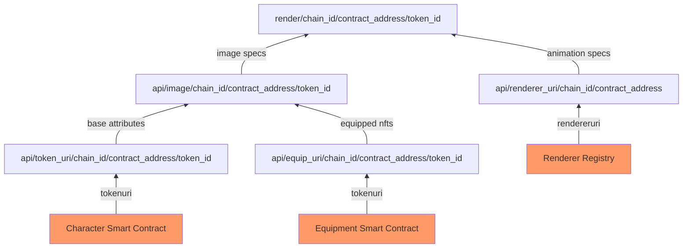
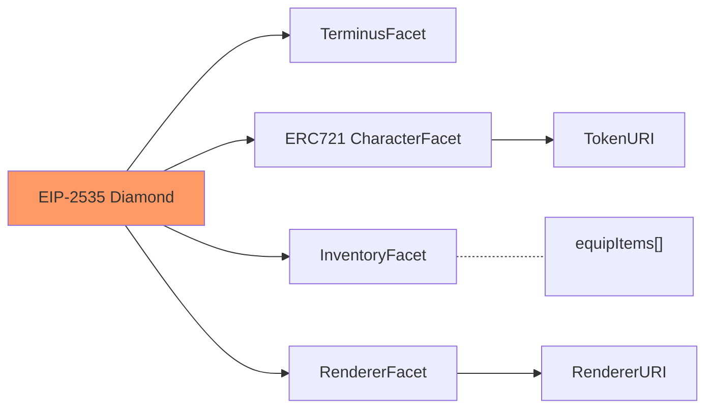
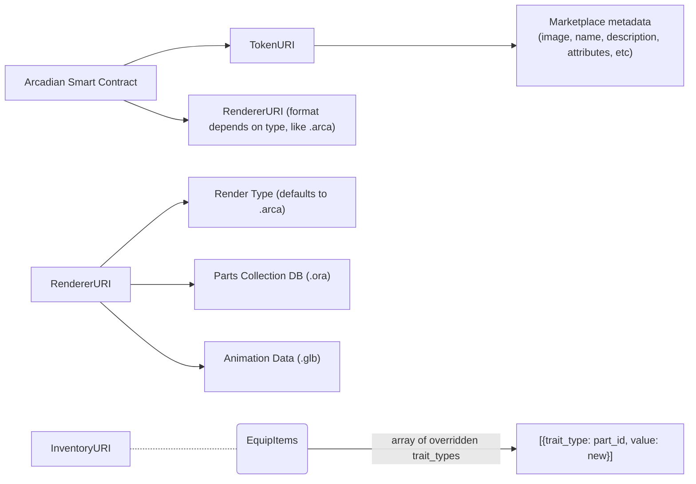

# OPG: Cross-Game NFT Renderer

## What is it?

A reference implementation for an NFT allowing it to equip other NFTs, and to be displayed (and animated!) in any game.

## Why do we need it?

Being built on a blockchain, a superpower of NFTs is that they can be used across different games. One challenge, however, is that each game has different technical specifications such as use of game engines, data formats, etc. This makes it challenging to integrate NFTs across different game genres.

The OPG: Cross-Game Renderer addresses this by allowing us to define how a specific NFT collection is rendered. This is done via a registry, similar to [EIP-6551](https://eips.ethereum.org/EIPS/eip-6551). 

An example implementation using the [Open Raster Format](https://gitlab.com/inklabapp/jsora) (.ora) for image layers and [GL Transmission File](https://learn.microsoft.com/en-us/windows/mixed-reality/distribute/creating-3d-models-for-use-in-the-windows-mixed-reality-home) (.gltf) for animation is used as a demo, but the registry is easily extensible for other image or animation formats, such as [.json files for 2d skeletal animation](https://github.com/EsotericSoftware/spine-runtimes/).

## Getting Started

Run the development server:

`yarn dev`

### Rendering Examples

To properly render an NFT it has to be registered on the registry, such as:

- [http://localhost:3000/render/mainnet/0xc3c8a1e1ce5386258176400541922c414e1b35fd/1](http://localhost:3000/render/mainnet/0xc3c8a1e1ce5386258176400541922c414e1b35fd/1)
- 

Backwards-compatibility for non-registered tokens is provided by the [use-nft react hook](https://github.com/spectrexyz/use-nft):

- [http://localhost:3000/render/ethereum/0x9C8fF314C9Bc7F6e59A9d9225Fb22946427eDC03/639](http://localhost:3000/render/ethereum/0x9C8fF314C9Bc7F6e59A9d9225Fb22946427eDC03/639)
- [http://localhost:3000/render/ethereum/0xff9c1b15b16263c61d017ee9f65c50e4ae0113d7/763](http://localhost:3000/render/ethereum/0xff9c1b15b16263c61d017ee9f65c50e4ae0113d7/763)

### Rendering Overview



**********Creating additional render formats**********

The example project uses the .arca rendering format, which uses .ora files for image generation and .gltf for animation. Example routes are provided as reference:

- [http://localhost:3000/example/ora](http://localhost:3000/example/ora) - image from assets/ora/assets.ora
- [http://localhost:3000/example/ora/gltf](http://localhost:3000/example/ora/gltf) - image from assets/ora/assets.ora, animation from assets/gltf/assets.gltf

**********Registering a token and its corresponding render format**********

******************************************Running with Contract******************************************

Deploy the contracts to a local hardhat instance:

`yarn deploy`

Take note of the deployed RendererFacet contract’s address.

Mint a test NFT:

`yarn mint`

Visit http://localhost:3000/api/31337/[contract_address]/1, replacing [contract_address] with the deloyed RenderefFacet, to see a render with contract interaction.

******************************************Updating****************************************** 

- Create an ORA file of your NFT images
- Update the backend with the ORA location

Frequently Asked Questions

## What is a Facet?

The Renderer Facet follows the [EIP-2535 Diamond Standard](https://eips.ethereum.org/EIPS/eip-2535). Facets allow the contract to be upgradable, while still giving the flexibility of making the contract immutable when it needs to be.

— All text below are still in progress  👇

### Smart Contract Format



## URI Format



### Examples:

********TokenURI******** 

- hosted on a url (http:// , ipfs:// , etc)
    - For Arcadians v2: api.arcadians.io/v2/#id
- attributes field is used for marketplaces such as Opensea
    - more info: [https://docs.opensea.io/docs/metadata-standards](https://docs.opensea.io/docs/metadata-standards)
- image field takes a representation viewable on Opensea
    - recommended dimension: 350x350

```json
{
		"id": 2318
    "name": "Magus of Zwei",
    "description": "Despite his power and knowledge, Magus of Zwei is a humble being, never seeking recognition or reward for his actions. He is driven by a greater purpose, and will stop at nothing to achieve it.",
    "image": "https://api.arcadians.io/v2/image/2318",
		"animation_url": "https://renderer.arcadians.io/2318",
		"background_color": "bd00e3",
		"external_url": "https://arcadia.fun/",
		"attributes": [
			{
				trait_type: "Class",
				value: "Male Gunner"
			},
			{
			trait_type: "Left Hand",
			value: "None"
			},
			{
			trait_type: "Right Hand",
			value: "Soda Popper R"
			},
			// these attributes are used by the renderer
			{
			trait_type: ".arca.default-animation",
			value: "Idle"
			},
			...
		]
}
```

### On TokenURI and API Updates

- We will use the TerminusFacet to allow players more permissions with their item
    - like changing name, description
- By default we set Arcadia as game master permission
    - Allows us to update fields using UI and scripts
- APIs should have a function that updates the attributes field with latest values
    - this might be needed in case we need to change the apis / animation_url
- Since this is an on-chain transaction, we need to design the flow

**********************RendererURI**********************

- projects can use their own format, the .arca format is an open standard used by arcadia and friends
- use ORA file for parts data and textures and GLB for animation data
    - exported by the avatar builder, and uploaded to nft.storage

- use tokenURI attributes as default to render image
- use InventoryFacet for additional equipment
    - override trait_types

```json
{
		"file_type": ".arca",
		"renderer_url": "https://renderer.arcadians.io",
		"parts_collection_type": ".ora",
		"parts_collection_url": "https://bafybeichn5lkkk4grjpq27a56le76nicqugadtxi24auoc6sn2sll2ctuy.ipfs.dweb.link.ora/",
		"animation_type": ".glb",
		"animation_url": "https://bafybeichn5lkkk4grjpq27a5sn2sll2ctuy.ipfs.dweb.link.glb/"
}
```

Questions:

- How do we add new items?
    - We use the inventory facet and override trait_types
- Why not add RendererURI into the token_uri instead of making it a separate Facet?
    - Facets give us flexibility to update specs as needed
- As a player, i’m concerned with Arcadia being game master of items
    - We will provide owners an option to re-assign gamemaster in the contract